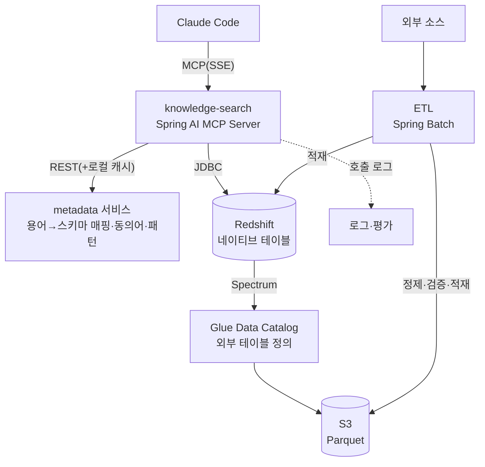
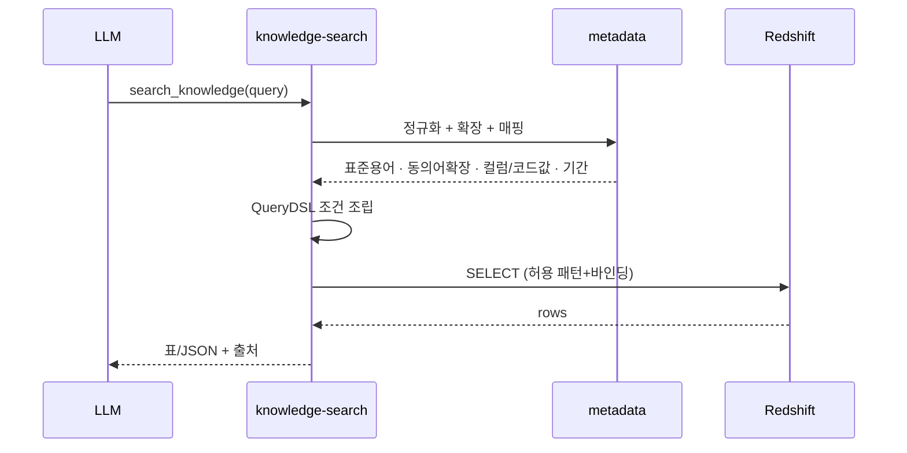

# 사내 지식 검색 시스템 (RAG) — 설계 PRD

> **Version**: v1.1.0
> **작성일**: 2026-06-07
> **프로젝트**: `knowledge-search`
> **역할**: Claude Code가 MCP 도구 호출로 사내 정형 지식을 직접 검색하는 RAG 백엔드 + MCP 서버
> **스택**: Java 21 · Spring Boot 3.5.x · Spring AI(MCP Server) · JPA · QueryDSL · Spring Batch · Redshift · Redshift Spectrum · Glue Data Catalog
> **연관 문서**: `metadata-ontology/.claude/docs/prd-metadata-ontology.md`

---

## 1. 무엇을, 왜

### 1.1 목표
- Claude Code가 사내 정형 지식을 **도구 호출로 직접 검색**하고, 그 결과를 근거로 답한다.
- 검색 계층을 **Redshift SQL 검색**으로 두어 벡터 DB 없이 운영한다.
- **Redshift Spectrum + Glue Data Catalog**로 S3 데이터 레이크(Parquet)와 외부 연동 데이터를 SQL 한 곳에서 조회한다.
- 적재 단계에서 데이터를 정제·검증해 잘못된 데이터가 답변 오류로 번지지 않게 막는다.

### 1.2 왜 벡터 DB를 안 쓰는가 (이 프로젝트의 핵심 결정)
- **검색 질의의 90% 이상이 정형 데이터 조회다.** 검색 로그를 분석하면 대부분의 질의가 코드값·식별자·기간 필터로 떨어진다(질의 분포 기준 — 로그는 질의가 무엇을 찾는지를 말해준다). 이런 질의는 SQL이 더 정확하고 빠르다.
  > 측정: 운영 search_log 의 질의(query_normalized)를 코드값·식별자·기간 필터 포함 여부로 분류한 분포. 원시 로그는 사내 자산이라 레포에 없고, 동일 측정은 search_log 스키마 + scripts/redshift/README 의 분류 SQL 로 재현한다.
- **도메인 식별어는 임베딩이 약하다.** 사번·코드값·약어처럼 사전에 없던 토큰은 벡터 표현이 부정확해, 의미가 비슷한 엉뚱한 결과가 먼저 나온다. 키워드·코드값 매칭이 이 문제를 안 만든다.
- **운영이 단순하다.** 임베딩 파이프라인, 벡터 인덱스, 재순위 모델을 따로 굴리지 않는다.

> 비정형 문서 비중이 커지면 벡터 검색을 더하는 방향으로 재검토한다(§13).

### 1.3 비목표
- 벡터 임베딩 기반 의미 검색 — 1차 제외.
- 이미지·PDF 원문 전면 색인 — 1차 제외.
- 자연어를 임의 SQL로 바꾸는 자동 생성 — 안전을 위해 **온톨로지 매핑 + 허용된 패턴**으로만 제한(§6).

### 1.4 성공 기준
- 핵심 질의셋을 만들어 정확도를 측정하고, 릴리스마다 점수를 추적한다(§9).
- 도구 호출당 평균 응답 1초 안팎.
- 매핑 안 된 키워드 비율이 시간이 지날수록 줄어든다(P2 사전 보강과 연결).

---

## 2. 시스템 아키텍처



검색 한 번의 흐름:
1. Claude Code가 MCP 도구(`search_knowledge` 등)를 호출한다.
2. knowledge-search가 metadata 서비스로 질의를 정규화·확장하고, 용어를 물리 컬럼·코드값으로 매핑받는다.
3. 매핑 결과로 허용된 조건만 바인딩 파라미터로 조립해(local: QueryDSL, redshift: JdbcTemplate — §3.1) Redshift(네이티브 + Spectrum 외부 테이블 통합 뷰)에 SELECT를 날린다.
4. 결과를 표·JSON과 출처로 묶어 MCP 응답으로 돌려준다.
5. 적재는 별도로, ETL이 외부 소스를 정제·검증해 S3 Parquet·Redshift에 넣고 Glue 파티션을 등록한다.

---

## 3. 기술 선택과 제약

| 항목 | 선택 | 이유 |
|---|---|---|
| 언어·프레임워크 | Java 21 / Spring Boot 3.5.x | 모노레포 표준(backend-2.0와 동일) |
| MCP 서버 | Spring AI MCP Server Starter 1.0.0 (webmvc=SSE) | 도구를 빈·어노테이션으로 노출 (§12 확정) |
| 쿼리 | local: JPA + QueryDSL 5.1.0(jakarta) / redshift: NamedParameterJdbcTemplate | 동적 조건 조립 패턴 재사용. Redshift 에 JPA 를 안 태우는 이유는 §3.1 |
| 검색 저장소 | Redshift | 정형 데이터 대량 조인·집계에 강함 |
| 이기종 통합 | Spectrum + Glue | S3 Parquet·외부 데이터를 SQL 하나로 조회 |
| ETL | Spring Batch | 청크·파티션·재시도. batch-2.0 운영 경험 재사용 |

### 3.1 Redshift 검색 경로에 JPA 를 태우지 않는 이유 (확정)
- Redshift는 PostgreSQL 호환 프로토콜이라 JDBC로 붙지만, **Hibernate 를 태울 수 없는 제약**이 있다: PK/UNIQUE 미강제, IDENTITY 가 JDBC `getGeneratedKeys` 를 지원하지 않아 Hibernate IDENTITY 삽입 전략이 동작 불가, CLOB 미지원(`body` 는 VARCHAR(65535)).
- 그래서 **redshift 프로파일은 `NamedParameterJdbcTemplate` 어댑터**(`RedshiftKnowledgeRecordRepositoryImpl`/`RedshiftSearchLogRepositoryImpl`)가 도메인 포트를 구현하고, local(H2)은 기존 JPA/QueryDSL 어댑터를 쓴다 — 포트는 동일, 검색 시맨틱(토큰 OR·코드값 AND·랭킹·기간 토큰 제외)도 동일.
- **제약(PK/FK)은 선언해도 강제되지 않는다**(플래너 참고용). 무결성은 적재 단계(content_hash 중복 제거)가 보장한다.
- **IDENTITY 키는 값의 연속성·생성 키 회수를 보장하지 않는다.** 애플리케이션은 이에 의존하지 않는다(INSERT 시 id 생략, 중복 판정은 content_hash).
- Spring Batch 메타테이블은 시퀀스를 요구해 Redshift 에 둘 수 없다 → `@BatchDataSource` 임베디드 H2 로 분리(`BatchDataSourceConfig`).
- DDL은 Flyway 대신 `scripts/redshift/01~03` 마이그레이션 스크립트로 관리한다.

---

## 4. 데이터 모델

### 4.1 두 갈래 저장
| 구분 | 저장소 | 용도 |
|---|---|---|
| 네이티브 테이블 | Redshift 내부 | 자주 조회하는 정형 지식, 코드값 |
| 외부 테이블 | Glue Data Catalog → S3 Parquet | 대용량·이력성 데이터, 외부 연동 데이터 |

### 4.2 Glue 파티션 등록 — 조회 누락 방지 (확정)
- S3 파티션 경로(예: `s3://.../knowledge/dt=2026-06-07/`)를 Glue 외부 테이블 파티션에 매핑한다. Spectrum 은 카탈로그에 등록된 파티션만 조회하므로, **등록이 누락되면 최신 데이터가 조회에서 빠진다.**
- **등록 방식 확정: ETL 잡이 COMPLETED 로 끝나는 시점에 AWS SDK `glue:CreatePartition`** 으로 등록한다(`GluePartitionRegistrar` + `GluePartitionRegistrationListener`, 멱등 — `AlreadyExistsException` 무시). Redshift 의 `ALTER TABLE ... ADD PARTITION` 은 트랜잭션 블록 안에서 실행할 수 없어 배치 트랜잭션과 충돌 소지가 있고, Crawler 는 주기 실행이라 적재 직후 즉시성이 떨어져 배제했다. StorageDescriptor 는 외부 테이블 정의를 복사하고 Location 만 바꿔 포맷 정의를 테이블과 일치시킨다.

### 4.3 검색 대상 테이블(예시)
| 테이블 | 핵심 컬럼 | 위치 |
|---|---|---|
| `knowledge_record` | id, domain, title, body, source_url, code_values(SUPER), source_updated_at, content_hash | Redshift 네이티브 |
| `knowledge_archive` | dt(파티션), domain, ... | Spectrum/S3 |
| `search_log` | query_raw, query_normalized, tool, latency_ms, hit_count, judged_score | Redshift 네이티브 |

- `code_values`는 Redshift 반정형 타입인 `SUPER`로 두어 코드값 묶음을 한 컬럼에 담는다.
- `content_hash`는 중복 제거(§7)와 변경 감지에 쓴다.

---

## 5. MCP 도구 설계

Spring AI MCP Server로 도구를 노출한다.

### 5.1 도구
| 도구 | 입력 | 출력 | 설명 |
|---|---|---|---|
| `search_knowledge` | `query`, `domain?`, `filters?`, `limit?` | 레코드 요약 목록 + 출처 | 1차 검색. 내부에서 metadata로 정규화·확장 후 SQL 실행 |
| `get_record` | `id` | 원문 전체 + 메타데이터 | 근거 보강용 단건 조회 |
| `list_schema` | `domain?` | 검색 가능한 테이블·컬럼·코드값 | 어떤 필드로 검색되는지 LLM이 파악(metadata 카탈로그 사용) |

### 5.2 도구 호출 정책
1. 검색은 `search_knowledge`로 시작한다.
2. 간단한 질의는 요약 결과만으로 답한다.
3. 근거가 더 필요하면 `get_record`로 원문을 가져온다.
4. 결과가 부족하거나 모호하면 질의를 다듬어 다시 검색한다(최대 N회).
5. 어떤 필드가 있는지 모르면 `list_schema`를 먼저 부른다.

### 5.3 결과 가공
- 표·JSON에 **출처가 있으면 항상 붙인다.**
- 요약을 먼저 주고 원문은 `get_record`로 분리해, 한 번에 들어가는 토큰을 줄인다.

---

## 6. 검색 흐름



- **질의 정규화·확장은 metadata 서비스가 맡는다**: "지난달" 같은 표현을 실제 기간으로 바꾸고, 동의어를 표준 용어로 펼치고, 키워드를 물리 컬럼·코드값에 매핑한다.
- **조건 조립**: local(H2)은 QueryDSL `BooleanBuilder`(기존 패턴 재사용, `medi-hris-backend-2.0/.../EmployeeRepositoryCustomImpl.java` 참조), redshift 는 동일 시맨틱을 `NamedParameterJdbcTemplate` 로 조립한다(§3.1).
- **SQL은 자유 입력을 받지 않는다.** 허용된 패턴과 바인딩 파라미터로만 만들고, 코드값 키·값은 화이트리스트(`[A-Za-z0-9_-]{1,64}`)로 추가 검증한다. 쿼리 비용 점검(`EXPLAIN`)은 매 요청 경로에 넣지 않고 운영 튜닝 시 수동으로 수행한다 — 결과를 쓰지 않는 선행 EXPLAIN 은 왕복만 2배로 만든다.
- **랭킹**은 완전일치 > 코드값일치 > 부분일치 순으로 두고, 최신순(source_updated_at)을 가중한다.

---

## 7. ETL / 데이터 품질

Spring Batch로 만든다. 청크·파티션·재시도는 batch-2.0 패턴을 재사용한다.

```
외부 소스 → 읽기 → 정제·검증 → 중복 제거 → 쓰기(Redshift 네이티브) → Glue 파티션 등록
```

> 이 레포의 ETL 은 **Redshift 네이티브 적재 + Glue 파티션 등록**까지 책임진다. 아카이브용
> S3 Parquet 파일 자체는 레이크 파이프라인(Spark/Firehose 등)의 산출물이며, 이 서비스는
> 그 파티션을 카탈로그에 등록해 Spectrum 조회에 노출하는 역할이다(§4.2).

### 7.1 적재 단계에서 거르는 것
| 단계 | 처리 | 목적 |
|---|---|---|
| 필수 필드 검증 | null·공백·형식 위반 레코드는 건너뛰고 사유를 남긴다 | 누락 데이터가 답변 오류로 가지 않게 |
| 문자열 정규화 | 공백·대소문자·전각/반각·표기를 통일한다 | 매칭이 더 잘 걸리게 |
| 중복 제거 | `content_hash`(SHA-256)로 같은 내용을 한 건만 남긴다 | 같은 근거가 여러 번 잡혀 한쪽으로 쏠리지 않게 |
| 증분 처리 | 소스별 최종 수정 시각과 S3 변경분만 다시 읽는다 | 최신성 유지 + 처리량 절감 |

### 7.2 운영
- 수동 트리거 API 를 둔다(스케줄 실행은 운영 도입 시 — 미구현)(batch-2.0에 없던 수동 실행 보완).
- 청크 크기·파티션 수는 데이터량을 보고 맞춘다.

---

## 8. 잘못된 답변을 막는 장치

- **스키마·메타데이터를 먼저 깔아준다.** metadata가 준 스키마 설명을 답변 컨텍스트 맨 위에 둬서, LLM이 데이터를 제멋대로 해석하지 않게 한다.
- **출처를 같이 준다.** 모든 응답에 링크·식별자를 붙인다.
- **응답 형식을 고정한다.** 핵심답변 → 상세 → 출처 → 신뢰도(높음/중간/낮음).
- **검색 결과 밖은 추측하지 않게** 제약을 건다.
- **두 단계로 거른다(선택):** 후보를 넓게 모은 뒤, 근거가 없는 항목은 버린다.
- **민감정보는 막는다.** 적재·응답 양쪽에서 민감 컬럼을 가리고, 걸리면 차단한다.

---

## 9. 평가 / 관측성

| 항목 | 방법 |
|---|---|
| 정량 | RAGAS 지표(검색 근거의 적중률·답변의 근거 충실도), 도구 호출 수·토큰·지연 |
| 정성 | 핵심 질의셋을 LLM이 0~10점으로 채점, 신규 입사 시나리오로 블라인드 비교 |
| 로깅 | `search_log` 테이블 + 호출 추적(질의·정규화·도구·결과·점수) |
| 보강 | 매핑 안 된 키워드와 저점수 질의를 모아 metadata 사전 보강으로 넘긴다 |

---

## 10. 보안 / 권한

- 요청자의 권한(RBAC·채널)을 확인하고 결과를 거른다.
- 색인에서 빼야 할 문서는 ETL 단계에서 제외한다.
- 민감 컬럼은 가리고 접근 로그를 남긴다.
- Redshift·Glue·S3 자격증명은 환경변수·EC2 환경 파일로 주입한다. **평문 커밋 금지.**

---

## 11. 로컬 / 배포

| 항목 | 값(제안) |
|---|---|
| 포트 | 8095 |
| 헬스 | `/health`, `/management/health/liveness` |
| 환경변수 | `REDSHIFT_HOST/PORT/DB/USER/PASS`, `GLUE_DATABASE`, `S3_BUCKET`, `AWS_REGION`, `METADATA_BASE_URL` |
| 배포 | 기존 Jenkins Blue/Green 흐름(Docker→ECR→토글→헬스체크→nginx 전환) |

---

## 12. 구현 전 확정 사항 (결정 완료)

- ✅ Spring AI MCP Server Starter: `spring-ai-bom:1.0.0` + `spring-ai-starter-mcp-server-webmvc` (SSE 전송 `/sse`, Claude Code 연결은 레포 루트 `.mcp.json`). 1.1.x 업그레이드 시 streamable HTTP 전환 검토.
- ✅ Redshift DDL: `scripts/redshift/01~03` 마이그레이션 스크립트. 검색·적재는 JdbcTemplate 어댑터(JPA 미사용 — §3.1).
- ✅ Glue 파티션 등록: ETL COMPLETED 시점에 AWS SDK `glue:CreatePartition` (멱등) — §4.2.
- ✅ MCP 전송: SSE 단일 (webmvc 스타터 제공). stdio 미지원은 1.0.0 webmvc 의 제약.
- 검색 대상 도메인·테이블 목록과 허용 SQL 패턴 범위 — 도메인 확장 시점마다 갱신.

---

## 13. 마일스톤

| 단계 | 산출물 | 상태 |
|---|---|---|
| M1 | 골격 + MCP 연결 확인 | ✅ (.mcp.json + SSE 연결) |
| M2 | Redshift 네이티브 검색(`search_knowledge`, `get_record`) | ✅ 코드 완성 (JdbcTemplate 어댑터 — SQL 조립·와이어링은 테스트로, SQL 수용성은 AWS 문서 대조로 검증. 실클러스터 확인은 운영 배포 시) |
| M3 | Spectrum + Glue 외부 테이블, 파티션 등록 | ✅ 코드 완성 (DDL 스크립트 + 통합 뷰 + GluePartitionRegistrar — 검증 범위는 M2 와 동일) |
| M4 | ETL 품질 파이프라인(검증·정규화·중복 제거) | ✅ (증분 처리는 미구현 — §7.1) |
| M5 | 평가·로깅 + metadata 사전 보강 연결 | 부분 (SearchLog 적재 ✅ · RAGAS/채점은 미구현) |

---

## 부록. 루트 CLAUDE.md 카탈로그 추가 (제안, 이번엔 적용 X)

```
| `knowledge-search` | 사내 지식 검색(RAG) + MCP 서버 | Spring Boot 3.5 + Spring AI + Redshift | knowledge-search/CLAUDE.md |
| `metadata-ontology` | 경량 온톨로지·메타데이터 레이어 | Spring Boot 3.5 + JPA/QueryDSL | metadata-ontology/CLAUDE.md |
```
