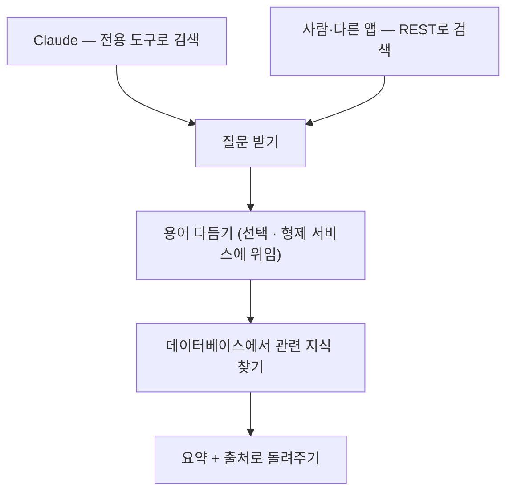

# knowledge-search

사내 정산 지식을 한곳에서 찾아 쓰게 해주는 검색 백엔드예요. Claude가 직접 사내 지식을 뒤져 답의 근거로 삼게 해주고, 일반 앱도 같은 검색을 가져다 쓸 수 있어요. 따로 벡터 DB를 두지 않고, 평범한 데이터베이스 검색만으로 동작해요.

이 문서는 이 서비스가 무엇을 하고 어떻게 짜여 있는지 한 바퀴 둘러봐요.

<br>
<br>

## 한눈에 — 어떻게 동작하나

질문이 들어오면 관련 지식을 찾아 **요약과 출처**로 돌려줘요. 필요하면 검색 전에 질문 속 표현을 표준말로 다듬는데, 그 일은 형제 서비스(metadata-ontology)에 맡겨요. 다듬기 연동은 꺼져 있어도 원래 질문 그대로 검색이 돼요.

들어오는 길은 둘이에요. Claude는 전용 도구로, 사람이나 다른 앱은 REST로 같은 검색을 불러요.



<br>
<br>

## 무엇으로 이뤄져 있나

**검색**

질문에 담긴 키워드와 코드값으로 관련 지식을 찾아, 얼마나 들어맞는지 점수를 매겨 정렬해요. 무거운 벡터 검색 대신 평범한 데이터베이스 질의로 처리해서 가볍게 돌아가요.

**Claude가 쓰는 도구 세 가지**

Claude가 대화 중에 바로 꺼내 쓰도록 도구 세 가지를 열어 뒀어요.

- 지식 검색 — 질문으로 관련 지식 목록과 출처를 받아요.
- 한 건 자세히 보기 — 고른 지식의 원문 전체를 봐요.
- 무엇을 검색할 수 있는지 보기 — 어떤 자료를 어떤 기준으로 찾을 수 있는지 미리 살펴봐요.

**같은 기능의 REST 입구**

도구와 똑같은 검색을 REST로도 부를 수 있어요. 동작을 확인하거나, 다른 앱에서 가져다 쓸 때 써요.

**용어 다듬기 연동 (선택)**

"미정산", "지난달" 같은 표현을 표준 용어와 실제 항목으로 바꾸는 일은 형제 서비스에 맡겨요. 기본은 꺼져 있고, 켜야 동작해요. 꺼져 있어도 원래 질문 그대로 검색되니 없어도 괜찮아요.

**데이터 모으기**

외부 정산 자료를 가져와 군더더기 공백을 정리하고, 같은 내용이 겹치면 하나만 남겨 쌓아요. 필요할 때 직접 한 번 돌리는 방식이에요.

<br>
<br>

## 레포에는 뭐가 들어있나

코드는 역할에 따라 네 겹으로 나눠 뒀어요.

- **핵심 규칙** — 지식 한 건과 검색 기록을 다루는, 바깥 사정에 얽히지 않는 부분이에요.
- **흐름 조율** — 검색이 어떤 순서로 흘러가는지 엮어요.
- **바깥 연결** — 데이터베이스 검색, 용어 서비스 호출, 데이터 모으기처럼 실제 바깥과 맞닿는 일을 맡아요.
- **입구** — Claude용 도구와 REST, 두 가지 들어오는 길이에요.

폴더로 보면 이렇게 놓여 있어요.

| 위치 | 무엇 |
|---|---|
| `src` | 위 네 겹으로 나뉜 서비스 코드예요. |
| `docs` | 설계와 점검 장치를 정리한 문서예요. |
| `.claude` | 코드가 설계 규칙을 지키게 잡아주는 가드레일(하네스)이에요. |
| `.github` | 코드를 올릴 때 구조를 한 번 더 확인하는 검사예요. |
| `scripts` | 점검 장치가 제대로 도는지 빠르게 확인하는 용도예요. |

설계 규칙을 자동으로 잡아주는 장치는 [opinionated-harness-template](https://github.com/HongJungWan/opinionated-harness-template)을 그대로 얹은 거예요. 자세한 쓰임새는 [`docs/HARNESS.md`](docs/HARNESS.md)에 있어요.

<br>
<br>

## 지금은 어디까지

- 기본 실행은 내 컴퓨터의 가벼운 임시 데이터베이스로 떠서, 외부 환경 없이 바로 시험해 볼 수 있어요.
- 큰 분석용 데이터베이스(Redshift) 경로도 코드로 들어 있어요 — `redshift` 프로파일을 켜면 검색·적재가 분석용 데이터베이스를 쓰고, 적재 작업이 끝나면 데이터 목록(Glue 카탈로그)에 그날의 보관 구간을 자동 등록해요. 보관 구간의 파일(S3 Parquet) 자체는 별도 레이크 파이프라인이 만들고, 이 서비스는 그 구간이 조회 목록에서 빠지지 않게 등록하는 역할이에요. 테이블 만드는 스크립트는 `scripts/redshift`에 있고, 실제 접속 값은 환경변수로 넣어요. 클라우드 계정이 없어도 SQL 조립·등록 멱등 로직·구성 조립까지는 테스트로 고정돼 있어요(실제 분석용 데이터베이스가 SQL을 받아주는지는 공식 문서 근거로 맞췄고, 최종 확인은 운영 배포 때 해요).
- 용어 다듬기 연동은 기본이 꺼짐이에요. 안 켜도 검색은 원래 질문으로 잘 돼요.
- 접속 정보는 환경변수로만 넣어요. 비밀번호 같은 값을 코드에 직접 적는 건 금지예요.

<br>
<br>

## 시작하기와 문서

JDK 21 이상이 있으면 바로 띄울 수 있어요.

```bash
./gradlew bootRun
```

서버는 `8095` 포트로 떠요. 살아있는지는 `/health`, 어떤 기능이 있는지는 `/swagger-ui.html`에서 둘러볼 수 있어요. 로컬 임시 데이터베이스는 `/h2-console`로 들여다봐요.

<br>
<br>

## Claude Code 연결하기

레포 루트의 `.mcp.json`이 연결 설정이에요. 서버를 띄운 뒤 이 폴더에서 Claude Code를 열면 자동으로 붙어요.

```bash
./gradlew bootRun          # 1) 서버 띄우기 (8095)
claude                     # 2) 레포 루트에서 Claude Code 실행
```

Claude Code 안에서 `/mcp`를 치면 `knowledge-search` 서버와 도구 3종(`search_knowledge` · `get_record` · `list_schema`)이 보여요. "미정산 정책 검색해줘"처럼 물으면 Claude가 `search_knowledge`를 직접 호출해서 사내 지식을 근거로 답해요.

- 전송 방식은 SSE(`http://localhost:8095/sse`)예요. Spring AI 1.0.0의 `spring-ai-starter-mcp-server-webmvc`가 제공하는 방식이에요.
- 참고: Claude Code에서 SSE 전송은 지원되지만 deprecated 상태예요. Spring AI 1.1.x로 올리면 streamable HTTP(`/mcp`)로 바꿀 수 있어요 — 업그레이드 시 `.mcp.json`의 `type`/`url`을 함께 바꿔요.

설계와 점검 장치를 더 알고 싶으면 [`docs/HARNESS.md`](docs/HARNESS.md)를 보면 돼요.
